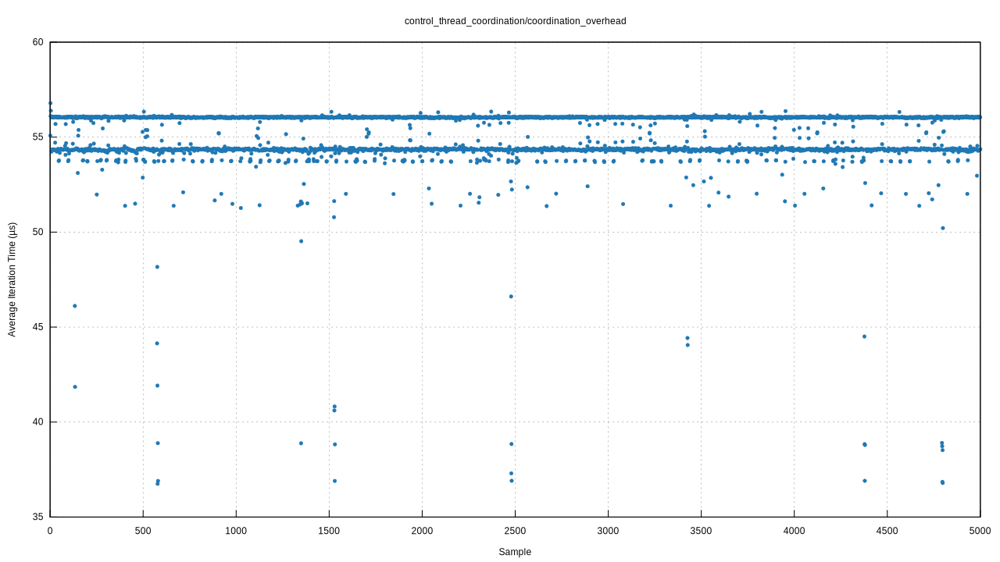
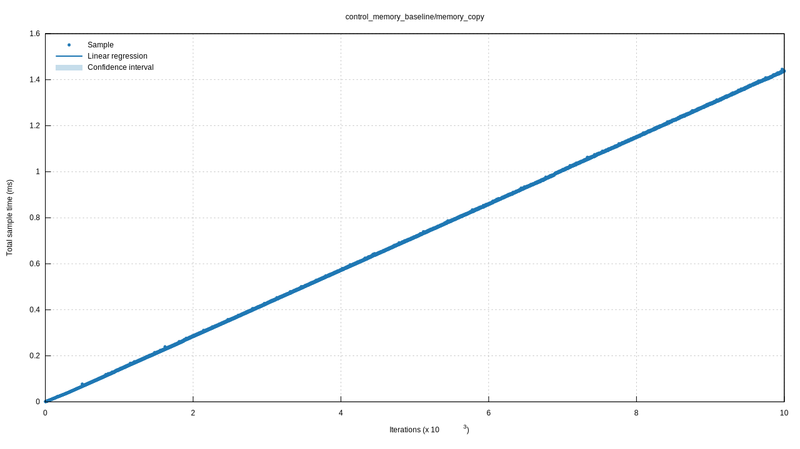
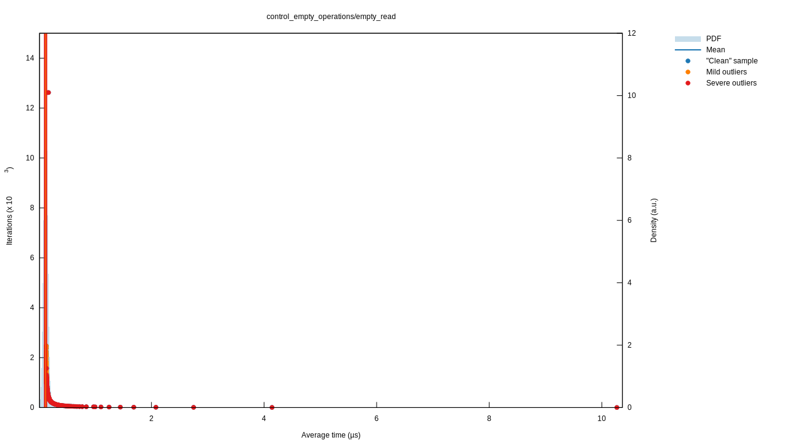
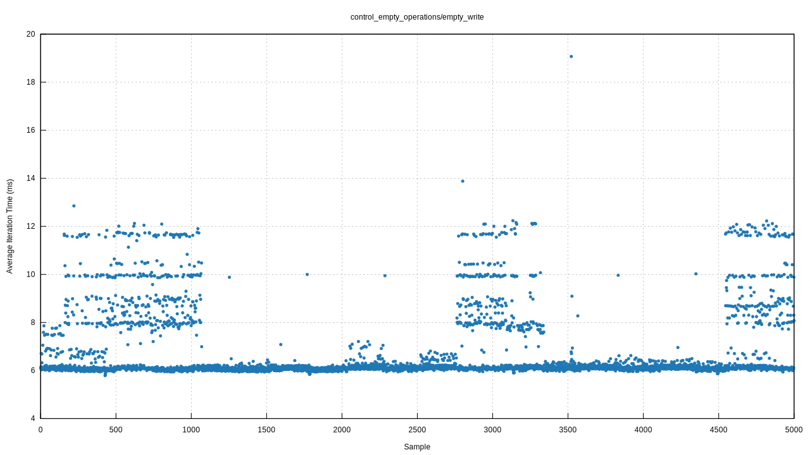
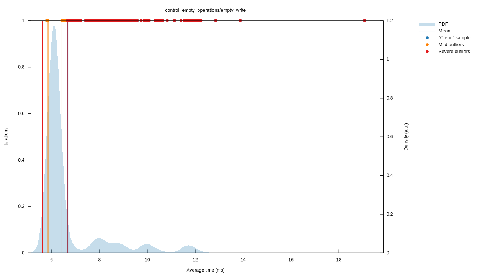
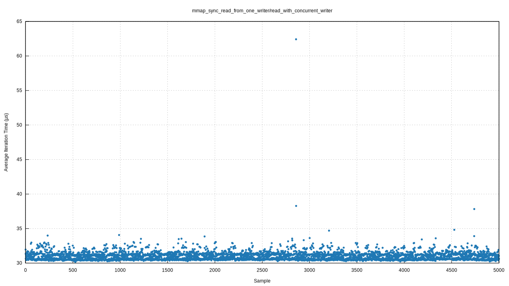
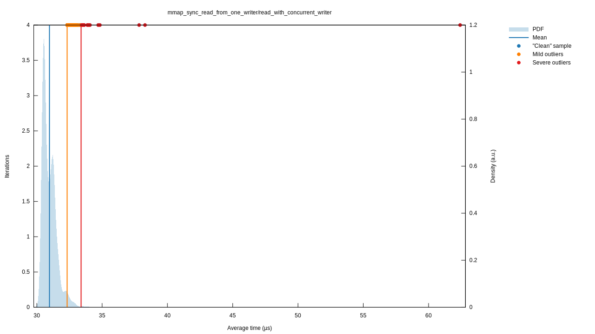
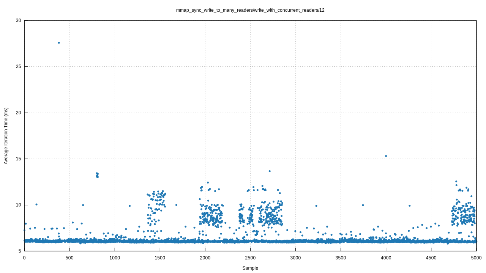
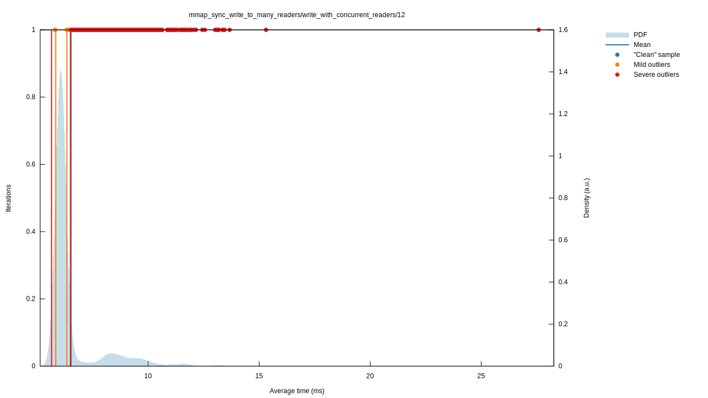

# mmap-sync benchmarking for high-frequency trading

This repo is focused on benchmarking the performance of the [Cloudflare's `mmap-sync` library](https://github.com/cloudflare/mmap-sync) in the context of high-frequency trading systems. The original benchmark provided by cloudflare only focuses on passing a single `bool` value (one byte) to multiple readers, which does not accurately portray how this library would be used in a real-world scenario. This benchmark will be using a more realistic scenario where the writer is sending a struct representing a `BestBidAsk` object (192 bytes) to 12 different readers with different polling intervals to assess the performance of the library in a more realistic scenario.

Skip to the [conclusion](#conclusion) if you are only interested in the results of the benchmark.

The test included in this benchmark are:

**Control Experiments:**

- `control_thread_coordination` - Baseline thread coordination overhead
- `control_memory_baseline` - Memory copy operation baselines
- `control_empty_operations` - Pure mmap operations without concurrent load
- `control_write_scaling` - Write latency scaling analysis (1, 3, 6, 9, 12 readers)

**Core Performance Tests:**

- `mmap_sync_write_to_many_readers` - Writer latency with multiple concurrent readers
- `mmap_sync_read_from_one_writer` - Reader latency with bursty writer pattern

All benchmarks can be found in the [`benches/mmap_bench.rs`](./benches/mmap_bench.rs) file.

---

- [mmap-sync benchmarking for high-frequency trading](#mmap-sync-benchmarking-for-high-frequency-trading)
- [Benchmarking methodology and testbench setup](#benchmarking-methodology-and-testbench-setup)
  - [Modeling the data](#modeling-the-data)
  - [Modeling the frequency of events](#modeling-the-frequency-of-events)
- [Control experiments and baseline measurements](#control-experiments-and-baseline-measurements)
- [Core benchmarks](#core-benchmarks)
  - [Testbench setup](#testbench-setup)
- [Running the benchmark](#running-the-benchmark)
- [Analyzing the results](#analyzing-the-results)
  - [Control experiments](#control-experiments)
    - [**Thread coordination overhead**](#thread-coordination-overhead)
    - [**Memory latency baseline**](#memory-latency-baseline)
    - [**Empty operations**](#empty-operations)
  - [Benchmark results](#benchmark-results)
    - [**Read Latency**](#read-latency)
    - [**Write latency**](#write-latency)
- [Confidence in results](#confidence-in-results)
- [Conclusion](#conclusion)

---

# Benchmarking methodology and testbench setup

The library used to benchmark `mmap-sync` is [`criterion.rs`](https://github.com/bheisler/criterion.rs), which is a rust benchmarking library that provides statistical analysis of the benchmark results. It is also the same library used by Cloudflare in [their benchmarks](https://github.com/cloudflare/mmap-sync?tab=readme-ov-file#benchmarks) of `mmap-sync`.

## Modeling the data

In terms of modeling the data, I used a struct representing a `BestBidAsk` object to represent the best bid and ask prices for a given symbol on an exchange. The `BestBidAsk` struct contains two `BidAsk` objects, one for the best bid and one for the best ask, each containing the side (buy/sell), exchange, symbol, price, size, and timestamp. The data is generated beforehand, then passed to the writer and readers in the benchmark.

```rust
struct BidAsk {
    pub side: String,
    pub exchange: String,
    pub symbol: String,
    pub price: f64,
    pub size: f64,
    pub timestamp: f64,
}
struct BestBidAsk {
    best_bid: BidAsk,
    best_offer: BidAsk,
}
```

## Modeling the frequency of events

In terms of modeling the frequency of events, I used two different distributions:

- For the writer, a [Hawkes distribution](https://wikipedia.org/wiki/Hawkes_process) was used to simulate the bursty nature of market data events, where events tend to cluster together in time.
- For the readers, a [Normal distribution](https://en.wikipedia.org/wiki/Normal_distribution) was used to model how different trading systems might poll data as quickly as they can process it. This tried to emulate a patterns of multiple readers accessing the data at different rates.

# Control experiments and baseline measurements

The control experiments were used to isolate the actual library performance from system overhead and measurement artifacts.

1. **Thread coordination overhead**
   The `control_thread_coordination` benchmark measures the pure overhead of coordinating multiple threads without any actual mmap operations. This establishes a baseline for the minimum latency introduced by the testing framework itself, allowing us to separate framework overhead from actual mmap-sync performance.
1. **Empty mmap operations**
   The `control_empty_operations` benchmark measures mmap read and write operations in isolation, without any concurrent load from other threads. This provides the theoretical best-case performance of mmap-sync operations and helps identify performance degradation caused by concurrent access patterns.
1. **Write scaling analysis**
   The `control_write_scaling` benchmark systematically tests write latency with 1, 3, 6, 9, and 12 concurrent readers. This scaling analysis reveals if/how write performance degrades as the number of readers increases, providing insight into the scalability characteristics of the mmap-sync library.
1. **Memory baseline**
   The `control_memory_baseline` benchmark measures simple memory copy operations to establish a lower bound for data transfer performance. This baseline helps contextualize mmap-sync performance relative to fundamental memory operations, indicating whether observed latencies are reasonable for the 192-byte data structures being transferred.

# Core benchmarks

1. **write_to_many_readers**
   This benchmark measures the latency and throughput of writing `BestBidAsk` objects to multiple readers concurrently. It aims to simulate a realistic high-frequency trading scenario where market data is being pushed to multiple consumers.

2. **read_from_one_writer**
    This benchmark measures the latency and throughput of reading `BestBidAsk` objects from a single writer. It simulates a scenario where multiple readers are consuming data from a single source.

## Testbench setup

The benchmark was run on a desktop computer with the following specifications:

- CPU: AMD Ryzen 7 5800X3D 8-Core Processor
- Memory: 32 GiB Synchronous Unbuffered (Unregistered) 3600 MHz
- Motherboard: X570 AORUS PRO WIFI
- Operating System: Manjaro Linux
- Kernel Version: 6.12.37-1-MANJARO (64-bit)

In order to reduce system jitter, the following kernel parameters were set:

| Kernel parameter                                      | Description                                                             |
| ----------------------------------------------------- | ----------------------------------------------------------------------- |
| systemd.unit=multi-user.target                        | Disable GUI to remove unnecessary background processes                  |
| initcall_blacklist=amd_pstate_init amd_pstate=disable | Disable  AMD P-state driver to ensure constant CPU frequency            |
| isolcpus=2-7                                          | Isolate CPU cores 2-7 from the scheduler to remove scheduler interrupts |
| nohz_full=2-7                                         | Disable timer interrupts on CPU cores 2-7                               |
| rcu_nocbs=2-7                                         | Disable RCU callbacks on CPU cores 2-7                                  |
| idle=poll                                             | Disable CPU idle states                                                 |
| nmi_watchdog=0                                        | Disable NMI watchdog                                                    |
| watchdog=none                                         | Disable watchdog                                                        |
| audit=0                                               | Disable audit subsystem                                                 |

Additionally, the following commands were run to move system threads and workqueues to CPU core 0 in order to prevent them from interfering with the benchmark as well as setting the CPU governor to "performance" mode to ensure the CPU doesn't change between different frequencies:

```bash
pgrep -P 2 | xargs -i taskset -p -c 0 {}
find /sys/devices/virtual/workqueue -name cpumask  -exec sh -c 'echo 1 > {}' ';'
sudo tee "performance" /sys/devices/system/cpu/cpu2/cpufreq/scaling_governor
```

# Running the benchmark

The benchmark itself was run with the following command, which enables rust optimizations and set the niceness level to -20 (highest priority):

```bash
RUSTFLAGS="-C target-cpu=native -C opt-level=3 -C codegen-units=1 -C lto" sudo nice cargo bench
```

# Analyzing the results
---

## Control experiments

The control experiments were run to establish a baseline for the performance of the `mmap-sync` library and to isolate the actual library performance from system overhead and measurement artifacts. The results of the control experiments are as follows

### **Thread coordination overhead**

The `control_thread_coordination` benchmark measures the pure overhead of coordinating multiple threads without any actual mmap operations. This establishes a baseline for the minimum latency introduced by the testing framework itself, allowing us to separate framework overhead from actual mmap-sync performance.

```ascii
control_thread_coordination/coordination_overhead
                        time:   [55.293 µs 55.335 µs 55.375 µs]
                        thrpt:  [18.059 Kelem/s 18.072 Kelem/s 18.086 Kelem/s]
                 change:
                        time:   [-0.1183% -0.0212% +0.0781%] (p = 0.67 > 0.05)
                        thrpt:  [-0.0781% +0.0212% +0.1185%]
                        No change in performance detected.
Found 57 outliers among 5000 measurements (1.14%)
  28 (0.56%) low severe
  29 (0.58%) low mild
```

<p float="left">
  
</p>

### **Memory latency baseline**

Looking at the memory baseline, we can see that the memory copy operation is significantly faster than the mmap-sync operations. This establishes a lower bound for the performance of the `mmap-sync` library and helps contextualize mmap-sync performance relative to fundamental memory operations.

```ascii
control_memory_baseline/memory_copy
                        time:   [143.56 ns 143.57 ns 143.59 ns]
                        thrpt:  [6.9644 Melem/s 6.9650 Melem/s 6.9657 Melem/s]
                 change:
                        time:   [+4.2681% +4.4983% +4.7099%] (p = 0.00 < 0.05)
                        thrpt:  [-4.4981% -4.3046% -4.0934%]
                        Performance has regressed.
Found 607 outliers among 5000 measurements (12.14%)
  397 (7.94%) low severe
  194 (3.88%) low mild
  2 (0.04%) high mild
  14 (0.28%) high severe
```

<p float="left">
  
</p>


### **Empty operations**

Looking at the empty operations, we can see that there is already an issue with the library: The write latency is very inconsistent, with a large standard deviation and a significant number of outliers. This suggests that the library is not able to handle concurrent writes efficiently, but the core benchmarks will provide more insight into this.

**Read**

```ascii
control_empty_operations/empty_read
                        time:   [117.27 ns 117.36 ns 117.47 ns]
                        thrpt:  [8.5131 Melem/s 8.5205 Melem/s 8.5275 Melem/s]
                 change:
                        time:   [-3.1061% +2.0262% +7.0027%] (p = 0.48 > 0.05)
                        thrpt:  [-6.5444% -1.9860% +3.2057%]
                        No change in performance detected.
Found 542 outliers among 5000 measurements (10.84%)
  186 (3.72%) high mild
  356 (7.12%) high severe
```
<p float="left">
  
  


**Write**

```ascii
control_empty_operations/empty_write
                        time:   [6.6377 ms 6.6748 ms 6.7129 ms]
                        thrpt:  [148.97  elem/s 149.82  elem/s 150.66  elem/s]
                 change:
                        time:   [+1.5302% +2.2985% +3.0481%] (p = 0.00 < 0.05)
                        thrpt:  [-2.9579% -2.2468% -1.5072%]
                        Performance has regressed.
Found 1009 outliers among 5000 measurements (20.18%)
  4 (0.08%) low mild
  64 (1.28%) high mild
  941 (18.82%) high severe
```

<p float="left">
  
  
</p>

## Benchmark results
---

Looking at the results, both the read and write latencies are higher than in the original benchmark. However, this is expected since we are sending a much larger amount of data (192 bytes vs 1 byte). Initially the both read and write latencies appear to be quite consistent, with the mean and median being relatively consistent. However, looking more closely at the write latencies, we can see that the standard deviation is quite high, which indicates potential latency issues (more on this later).

| Read latency |                |                |                |     | Write latency |               |               |               |
| ------------ | -------------- | -------------- | -------------- | --- | ------------- | ------------- | ------------- | ------------- |
|              | Lower bound    | Estimate       | Upper bound    |     |               | Lower bound   | Estimate      | Upper bound   |
| Throughput   | 32.271 Kelem/s | 32.293 Kelem/s | 32.312 Kelem/s |     | Throughput    | 153.09 elem/s | 153.86 elem/s | 154.63 elem/s |
| R²           | 0.0000532      | 0.0000533      | 0.0000532      |     | R²            | 0.0000304     | 0.0000305     | 0.0000304     |
| Mean         | 30.948 µs      | 30.966 µs      | 30.987 µs      |     | Mean          | 6.4669 ms     | 6.4992 ms     | 6.5321 ms     |
| Std. Dev.    | 523.50 ns      | 703.88 ns      | 956.43 ns      |     | Std. Dev.     | 1.0984 ms     | 1.1769 ms     | 1.2743 ms     |
| Median       | 30.809 µs      | 30.836 µs      | 30.861 µs      |     | Median        | 6.0735 ms     | 6.0762 ms     | 6.0796 ms     |
| MAD          | 477.58 ns      | 500.38 ns      | 518.54 ns      |     | MAD           | 81.561 µs     | 85.246 µs     | 88.877 µs     |

### **Read Latency**

Looking at the latency graph of the readers (where the write pattern follows a Hawkes distribution), we can see that the read latency remains mostly remains relatively consistent, with only one or two spikes in the latency. The undulating nature of the benchmark is related to the Hawkes distribution, which causes the writer to send bursts of data at random intervals. The readers are able to keep up with the writer, and the read latency remains relatively low (around 30-32 µs). The standard deviation of the read latency is also relatively low, at around 523 ns, which indicates that the read latency is fairly consistent. There are only 132 outliers (2.64%) in the read latency (spikes above 2 standard deviations), which is a good sign that the readers are able to keep up with the writer.

```ascii
mmap_sync_read_from_one_writer/read_with_concurrent_writer
                        time:   [30.948 µs 30.966 µs 30.987 µs]
                        thrpt:  [32.271 Kelem/s 32.293 Kelem/s 32.312 Kelem/s]
                 change:
                        time:   [+12.323% +12.764% +13.163%] (p = 0.00 < 0.05)
                        thrpt:  [-11.632% -11.320% -10.971%]
                        Performance has regressed.
Found 132 outliers among 5000 measurements (2.64%)
  116 (2.32%) high mild
  16 (0.32%) high severe
```

<p float="left">
  
  
</p>

### **Write latency**

Things take a turn for the worse when we look at the write latency. It's expected that the write latency is significantly higher than the read latency, but what is not expected is the huge spikes in latency encountered at semi-regular intervals. While the base latency for writing stays around 6.2ms, there are large and consistent spikes above 7ms, reaching up to 14ms. These account for 57 (1.14%) spikes between two and three standard deviations and a massive 746 (14.92%) latency spikes above three standard deviations. This a 233% increase in latency, which is unacceptable for a high-frequency trading system.

```ascii
mmap_sync_write_to_many_readers/write_with_concurrent_readers/12
                        time:   [6.4669 ms 6.4992 ms 6.5321 ms]
                        thrpt:  [153.09  elem/s 153.86  elem/s 154.63  elem/s]
                 change:
                        time:   [-5.2303% -4.4688% -3.6923%] (p = 0.00 < 0.05)
                        thrpt:  [+3.8338% +4.6779% +5.5189%]
                        Performance has improved.
Found 804 outliers among 5000 measurements (16.08%)
  1 (0.02%) low mild
  57 (1.14%) high mild
  746 (14.92%) high severe
```

<p float="left">
  
  
</p>

Scaling the number of readers from 1 to 12 does not seem to increase write latency, but we can see that there is still a large amount of variance in the write latency regardless of the number of readers:

<p float="left">
  
</p>

# Confidence in results

The control experiments establish that the write latency spikes are genuine characteristics of mmap-sync performance rather than measurement artifacts:

- **Thread coordination overhead** measurements confirm that the testing framework introduces minimal latency (typically <1µs), meaning the 6.5ms write latencies are attributable to mmap-sync operations
- **Empty mmap operations** provide baseline performance without concurrent load, allowing isolation of concurrency-related performance degradation
- **Memory baseline** operations demonstrate that simple memory copies are orders of magnitude faster than observed mmap-sync latencies, confirming that the library introduces substantial overhead

# Conclusion
---

In conclusion, while `mmap-sync` has acceptable read latencies because they are relatively stable and consistent, the write latencies exhibit large and unpredictable spikes, which make this library unsuitable for low-latency applications. This is consistent with the characteristics of the Inter-process Communication (IPC) mechanism used by `mmap-sync`: Memory-mapped files. Memory-mapped are known to have issues due their reliance on page faults and delayed write-backs [[1]](blog.devgenius.io/why-memory-mapped-files-arent-as-good-as-you-think-they-are-49dadade221a)., which can cause unpredictable latency spikes; When an application accesses a part of a memory-mapped file that is not currently in physical memory, a page fault occurs, triggering the OS to load data from disk. This disk I/O is relatively slow and introduces latency. Moreover, writes to memory-mapped files are typically delayed until the OS decides to flush them back to disk, which can happen asynchronously and cause jitter or spikes in latency.

Because of this, `mmap-sync` is not suitable for high-frequency trading applications that require consistent, low-latency performance. This aligns with industry knowledge, where other types of Inter-process Communication (IPC) mechanisms like shared memory (e.g. ring queues) are typically preferred for their lower latencies [[2]](https://3tilley.github.io/posts/simple-ipc-ping-pong/).

If you are interested in the report (which contains additional statistics about the benchmark), you can find it in the `report` directory. Additionally, the raw benchmark data can be found in the `data` directory.
